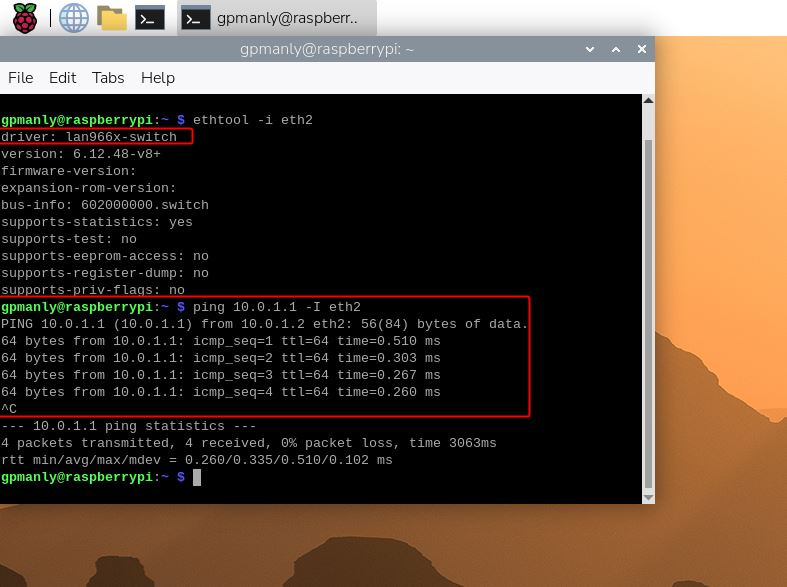

# Integrating LAN966x to Raspberry Pi OS
## Summary

This document describes the process of integrating the **LAN966x PCIe network switch driver** into the standard Raspberry Pi OS, running on a Raspberry Pi Compute Module 4 (CM4). The official RPi OS doesn't natively support LAN966x PCIe, so this build bridges that gap by compiling Microchip's Linux kernel fork with the necessary drivers and configurations, allowing users to run a full-featured Raspberry Pi OS alongside the LAN966x switch hardware.

The Raspberry Pi Compute Module 4 is an embedded platform, and Microchip's LAN966x is a multi-port Ethernet switch chip capable of advanced networking features. While Microchip provides a basic Board Support Package (BSP) for the two together, it lacks the full richness of the standard Raspberry Pi OS ecosystem, things like package management, and familiar tooling.

This project solves that by taking the best of both worlds: it starts with the standard 64-bit Raspberry Pi OS as the base, then builds and installs a custom kernel derived from Microchip's Linux fork (v6.12), configured with all the drivers needed to bring the LAN966x switch to life over PCIe.

---
## General Idea

The core idea is straightforward, **replace the stock Raspberry Pi kernel with a custom-built one that includes LAN966x PCIe support**, while keeping everything else about the Raspberry Pi OS intact. The process flows like this:

The build starts by cloning Microchip's Linux kernel repository and checking out the v6.12 branch. Rather than building from scratch, it borrows the `bcm2711_defconfig` (the standard RPi 4 kernel config) from the official Raspberry Pi kernel fork as a baseline, ensuring hardware compatibility with the CM4. On top of that, a set of additional kernel config options are enabled, primarily the LAN966x switch driver, DSA (Distributed Switch Architecture) framework, SerDes PHY, and various I2C and pinctrl components that the switch depends on.

Device tree sources and overlays are similarly pulled from the Raspberry Pi fork to ensure proper hardware description at boot, and a custom device tree (`bcm2711-rpi-cm4-lan966x.dtb`) is used to describe the combined CM4 + LAN966x hardware. A minor patch is also applied to fix a missing `MODULE_LICENSE` tag that would otherwise break the kernel module build.

Once built, the kernel image, modules, and device tree blobs are installed onto the RPi boot media, and `config.txt` is updated to point to the new kernel and device tree. After booting, the LAN966x switch enumerates over PCIe and its ports appear as standard Linux network interfaces (`eth1`–`eth4`), fully manageable with familiar tools like `ip` and `ethtool`.

The end result is a Raspberry Pi that boots into a normal, full-featured Raspberry Pi OS — but with a multi-port Ethernet switch ready to use.

---
## Hardware:
* EVB-LAN9662-NIC
* Raspberry Pi Compute Module 4 (CM4)
* Raspberry Pi IO Board
## Build Environment:
+ Ubuntu Linux 24.04 LTS
+ **Target Kernel Version v6.12.48-v8+**

**Packages:**
```shell
sudo apt-get install subversion build-essential bison flex gettext libncurses5-dev texinfo autoconf automake libtool mercurial git-core gperf gawk expat curl cvs libexpat-dev bzr unzip bc python-dev wget cpio rsync xxd bmap-tools libssl-dev
```

---
## Prepare the Raspberry Pi OS:
Install the Raspberry Pi OS 64-bit by following [Install using Imager](https://www.raspberrypi.com/documentation/computers/getting-started.html#raspberry-pi-imager). Use the following options

_Raspberry Pi Device:_ **Raspberry Pi 4**
_Operating System:_ **Raspberry Pi OS (64-bit)**

---
## **Build the Microchip Linux Kernel:**
The Linux Kernel we will use is from the Microchip's Fork. The kernel version we'll be using is `v6.12`--the latest version as of this writing. We will also use the `bcm2711_defconfig` from Raspberry Pi's Fork as the base config.

### 1. Prepare the Linux-UNG Repository
```shell
git clone https://github.com/microchip-ung/linux linux-ung
```
Checkout the Kernel Version 6.12
```shell
cd linux-ung
git checkout bsp-6.12-2025.12
```
### 2. Prepare the `defconfig` from the Raspberry Pi Repository
Add the Raspberry Pi remote and fetch the `rpi-6.12.y`
Overwrite `bcm2711_defconfig` file from Raspberry Pi Repository to `arch/arm64/configs/`
```shell
# Add the raspberrypi remote
git remote add rpi https://github.com/raspberrypi/linux.git

# Fetch only the specific branch (no need to fetch everything)
git fetch rpi rpi-6.12.y

# Copy/overwrite the configs from that branch into your working tree
git checkout rpi/rpi-6.12.y -- arch/arm64/configs/bcm2711_defconfig
```
> **Note:** The version of the defconfig should match with our target version.
### 3. Build Configuration
```shell
# for 64-bit
KERNEL=kernel8
make -j12 ARCH=arm64 CROSS_COMPILE=aarch64-linux-gnu- bcm2711_defconfig
```

> **Note:** The `bcm2711_defconfig` loads the default Linux configuration for the Raspberry Pi  

Add the LAN966x drivers and related components in the Linux config:
```shell
make -j12 ARCH=arm64 CROSS_COMPILE=aarch64-linux-gnu- menuconfig
```

> Tip: Inside menuconfig, press **`'/'`** key. Type the config, i.e., **LAN966x**. It'll display all the config option having this string. Press the number against the desired option. It'll take you to that specific hardware configuration. Change configuration with a **`'space'`**, **`'Y'`**, or **`'N'`** key.
```c
# Tick [Y] to Add
<*> The IPv6 protocol                         (IPV6 [=y])
[*] Distributed Switch Architecture           (NET_DSA [=y])
<*> 802.1d Ethernet Bridging                  (BRIDGE [=y])
[*] Data Center Bridging support              (DCB [=y])
<*> Lan966x switch driver                     (LAN966X_SWITCH [=y])
<*> Microchip LAN966X Support                 (MFD_LAN966X_PCI [=y])
<*> SerDes PHY driver for Microchip LAN966X   (PHY_LAN966X_SERDES [=y])
<*> SFP cage support                          (CONFIG_SFP [=y])
[*] Microchip Sparx5 SoC family               (ARCH_SPARX5 [=y])
<*> Sparx5 switch driver                      (SPARX5_SWITCH [=y])
[*] Microchip Sparx5 reset driver             (RESET_MCHP_SPARX5 [=y])
<*> Microchip Sparx5 SerDes PHY driver        (PHY_SPARX5_SERDES [=y])
<*> Microsemi MIIM interface support          (MDIO_MSCC_MIIM [=y])
{*} I2C bus multiplexing support              (I2C_MUX [=y])
<*> pinctrl-based I2C multiplexer             (I2C_MUX_PINCTRL [=y])
<*> pinctrl-based I2C demultiplexer           (I2C_DEMUX_PINCTRL [=y])
<*> GPIO-based bitbanging I2C                 (I2C_GPIO [=y])
<*> GPIO-based I2C multiplexer                (I2C_MUX_GPIO [=y])
<*> I2C device interface                      (I2C_CHARDEV [=y])
<*> Atmel AT91 I2C Two-Wire interface         (I2C_AT91 [=y])
<*> Microchip AT91 I2C experimental slave mode (I2C_AT91_SLAVE_EXPERIMENTAL [=y])
<*> Broadcom BCM2835 I2C controller           (I2C_BCM2835 [=y])
<*> BRCM Settop/DSL I2C controller            (I2C_BRCMSTB [=y])
[*] Atmel Flexcom                             (MFD_ATMEL_FLEXCOM [=y])
<*> Pinctrl driver for Microchip Serial GPIO  (PINCTRL_MICROCHIP_SGPIO [=y])
<*> Pinctrl driver for the Ocelot and Jaguar2 SoCs (CONFIG_PINCTRL_OCELOT)
<*> High-availability Seamless Redundancy     (HSR [=y])
[*] IP-VLAN support                           (IPVLAN [=y])
<*> Userspace I/O drivers                     (UIO [=y])
<*> Userspace I/O platform driver with generic IRQ handling (UIO_PDRV_GENIRQ [=y])
<*> Generic driver for Sparx5 SoC             (UIO_SPARX5 [=y])  
<*> Generic driver for Sparx5 SoC             (UIO_SPARX5_IRQMUX [=y]) 

# Tick [N] to Remove
[ ] IOMMU Hardware Support                       (IOMMU_SUPPORT [=n])
[ ] NUMA Memory Allocation and Scheduler Support (NUMA [=n])
[ ] Support for hot-pluggable CPUs               (CONFIG_HOTPLUG_CPU[=n])  
[ ] Randomize the address of the kernel image    (RANDOMIZE_BASE [=n])
  
```

Save and Exit
```
<Save>
<Exit>
```
### 4. Prepare the Device-Tree
Copy the device tree sources `dts` and overlays `dtso` from Raspberry Pi Repository:
```shell
# Copy the arm64 dts from Raspberry Pi Repository into the working tree
git checkout rpi/rpi-6.12.y -- arch/arm64/boot/dts/broadcom

# Copy the arm dts from Raspberry Pi Repository into the working tree
git checkout rpi/rpi-6.12.y -- arch/arm/boot/dts/broadcom

# Copy the dtso from Raspberry Pi Repository into the working tree
git checkout rpi/rpi-6.12.y -- arch/arm64/boot/dts/overlays
git checkout rpi/rpi-6.12.y -- arch/arm/boot/dts/overlays

# Copy the Makefile from Raspberry Pi Repository into the working tree
git checkout rpi/rpi-6.12.y -- arch/arm64/boot/dts/Makefile

git checkout rpi/rpi-6.12.y -- scripts/Makefile.lib
git checkout rpi/rpi-6.12.y -- scripts/Makefile.build

```
Copy some dependencies from the `include` to properly build the `dts` and `dtso`
```shell
# Copy the dependencies from Raspberry Pi Repository into the working tree
git checkout rpi/rpi-6.12.y -- include/dt-bindings/clock/rp1.h
git checkout rpi/rpi-6.12.y -- include/dt-bindings/gpio/gpio-fsm.h
git checkout rpi/rpi-6.12.y -- include/dt-bindings/mfd/rp1.h
```
The device tree to use is `bcm2711-rpi-cm4-lan966x`.
* Edit the `Makefile` to include `bcm2711-rpi-cm4-lan966x` during build:
```shell
nano arch/arm64/boot/dts/broadcom/Makefile
```
* Insert `bcm2711-rpi-cm4-lan966x.dtb` on this location like so:
```c
dtb-$(CONFIG_ARCH_BCM2835) += bcm2711-rpi-cm4-lan966x.dtb
```

### 5. Patch `drivers/mux/sparx5-spi.c`
`modpost` will fail in the build because one of the objects doesn’t contain a `MODULE_LICENSE()` tag. The kernel build treats that as an error for modules. And so, edit `drivers/mux/sparx5-spi.c` and add a license declaration near the bottom:

```shell
echo 'MODULE_LICENSE("GPL");' >> drivers/mux/sparx5-spi.c
```

### 6. Build
Run the following command to build a 64-bit kernel, modules and the device-tree blob:
```shell
make -j12 ARCH=arm64 CROSS_COMPILE=aarch64-linux-gnu- Image modules dtbs
```
> The build may take a while so grab a coffee ☕
### 7. Install the Kernel

Having built the kernel, you need to copy it onto your Raspberry Pi boot media (likely an SD card or SSD) and install the modules.

Find your boot media

* First, run `lsblk`. Then, connect your boot media. Run `lsblk` again; the new device represents your boot media. You should see output similar to the following:
```shell
$ lsblk
sdc
   sdc1
   sdc2
```
If `sdc` represents your boot media, `sdc1` represents the FAT32-formatted **boot partition** and `sdc2` represents the (likely ext4-formatted) **root partition**.

* Mount these partitions as `mnt/boot` and `mnt/root`, adjusting the partition letter to match the location of your boot media:
```shell
mkdir mnt
mkdir mnt/boot
mkdir mnt/root
sudo mount /dev/sdc1 mnt/boot
sudo mount /dev/sdc2 mnt/root
```
### 8. Next, install the kernel modules onto the boot media:
```shell
sudo env PATH=$PATH make -j12 ARCH=arm64 CROSS_COMPILE=aarch64-linux-gnu- INSTALL_MOD_PATH=mnt/root modules_install
```
### 9. Install Kernel onto the boot media:
Run the following commands to create a backup image of the current kernel, install the fresh kernel image, overlays.
```shell
sudo cp mnt/boot/$KERNEL.img mnt/boot/$KERNEL-backup.img
sudo cp arch/arm64/boot/Image mnt/boot/$KERNEL.img
sudo cp -r arch/arm64/boot/dts/broadcom/*.dtb* mnt/boot/
sudo cp -r arch/arm64/boot/dts/overlays/*.dtb* mnt/boot/overlays/
```
Modify `config.txt` to define the new kernel and device-tree at boot
```shell
sudo nano mnt/boot/config.txt
```
* Add the following texts at the bottom of `config.txt`, save then exit.
```shell
[all]
arm_64bit=1
kernel=kernel8.img       #boots the newly built kernel
dtoverlay=pcie-32bit-dma #this overlay prevents firmware from extending the PCIe inbound window beyond 32-bit
device_tree=bcm2711-rpi-cm4-lan966x.dtb #target DTB to be loaded
```
Type:
**`CTRL + O`** to save
**`CTRL + X`** to exit text editor

Unmount the partitions:
```shell
sudo umount mnt/boot
sudo umount mnt/root
```

Finally, connect the boot media to your Raspberry Pi and connect it to power to run your freshly-compiled kernel.

---
## **Verification:**
Boot the Raspberry Pi with the newly modified boot media

### Show Linux Version
```shell
uname –a

#It should return the following
Linux raspberrypi 6.12.48-v8+ #25 SMP PREEMPT Thu Feb 26 12:25:10 PST 2026 aarch64 GNU/Linux
```
### Show that the LAN966x driver is loaded and enumerated.
```shell
$ lspci -vv
```
It should return **`Kernel driver in use: microchip_lan966x_pci`**:
```shell
lspci -vv
00:00.0 PCI bridge: Broadcom Inc. and subsidiaries BCM2711 PCIe Bridge (rev 20) (prog-if 00 [Normal decode])
        Device tree node: /sys/firmware/devicetree/base/scb/pcie@7d500000/pci@0,0    
        Control: I/O- Mem+ BusMaster+ SpecCycle- MemWINV- VGASnoop- ParErr- Stepping- SERR- FastB2B- DisINTx-
        Status: Cap+ 66MHz- UDF- FastB2B- ParErr- DEVSEL=fast >TAbort- <TAbort- <MAbort- >SERR- <PERR- INTx-
        Latency: 0
        Interrupt: pin A routed to IRQ 0
        Bus: primary=00, secondary=01, subordinate=01, sec-latency=0
        Memory behind bridge: 00000000-043fffff [size=68M] [32-bit]
        Prefetchable memory behind bridge: [disabled] [64-bit]
        Secondary status: 66MHz- FastB2B- ParErr- DEVSEL=fast >TAbort- <TAbort- <MAbort- <SERR- <PERR-
        BridgeCtl: Parity- SERR- NoISA- VGA- VGA16- MAbort- >Reset- FastB2B-
                PriDiscTmr- SecDiscTmr- DiscTmrStat- DiscTmrSERREn-
        Capabilities: <access denied>

01:00.0 Ethernet controller: Microchip Technology / SMSC Device 9660
        Subsystem: Microchip Technology / SMSC Device 9660
        Device tree node: /sys/firmware/devicetree/base/scb/pcie@7d500000/pci@0,0/switch@0,0
        Control: I/O- Mem+ BusMaster+ SpecCycle- MemWINV- VGASnoop- ParErr- Stepping- SERR- FastB2B- DisINTx-
        Status: Cap+ 66MHz- UDF- FastB2B- ParErr- DEVSEL=fast >TAbort- <TAbort- <MAbort- >SERR- <PERR- INTx-
        Latency: 0
        Interrupt: pin A routed to IRQ 27
        Region 0: Memory at 600000000 (32-bit, non-prefetchable) [size=32M]
        Region 1: Memory at 602000000 (32-bit, non-prefetchable) [size=16M]
        Region 2: Memory at 603000000 (32-bit, non-prefetchable) [size=8M]
        Region 3: Memory at 603800000 (32-bit, non-prefetchable) [size=8M]
        Region 4: Memory at 604000000 (32-bit, non-prefetchable) [size=128K]
        Region 5: Memory at 604020000 (32-bit, non-prefetchable) [size=8K]
        Capabilities: <access denied>
        Kernel driver in use: microchip_lan966x_pci
```
IP Command
```shell
$ ip a
```
Returns:
```shell
$ ip a
1: lo: <LOOPBACK,UP,LOWER_UP> mtu 65536 qdisc noqueue state UNKNOWN group default qlen 1000
    link/loopback 00:00:00:00:00:00 brd 00:00:00:00:00:00
    inet 127.0.0.1/8 scope host lo
       valid_lft forever preferred_lft forever
    inet6 ::1/128 scope host noprefixroute
       valid_lft forever preferred_lft forever
2: eth0: <BROADCAST,MULTICAST,UP,LOWER_UP> mtu 1500 qdisc mq state UP group default qlen 1000
    link/ether d8:3a:dd:db:e2:99 brd ff:ff:ff:ff:ff:ff
    inet 10.161.140.95/24 brd 10.161.140.255 scope global dynamic noprefixroute eth0 
       valid_lft 7063sec preferred_lft 7063sec
    inet6 fe80::dd67:b251:6af5:21e6/64 scope link noprefixroute
       valid_lft forever preferred_lft forever
3: eth1: <NO-CARRIER,BROADCAST,MULTICAST,UP> mtu 1500 qdisc mq state DOWN group default qlen 1000
    link/ether 32:f8:29:c7:41:c1 brd ff:ff:ff:ff:ff:ff
4: eth2: <BROADCAST,MULTICAST,UP,LOWER_UP> mtu 1500 qdisc mq state UP group default qlen 1000
    link/ether 32:f8:29:c7:41:c2 brd ff:ff:ff:ff:ff:ff
    inet6 fe80::190e:42b8:31f2:1f18/64 scope link noprefixroute
       valid_lft forever preferred_lft forever
5: eth3: <NO-CARRIER,BROADCAST,MULTICAST,UP> mtu 1500 qdisc mq state DOWN group default qlen 1000
    link/ether 32:f8:29:c7:41:c3 brd ff:ff:ff:ff:ff:ff
6: eth4: <NO-CARRIER,BROADCAST,MULTICAST,UP> mtu 1500 qdisc mq state DOWN group default qlen 1000
    link/ether 32:f8:29:c7:41:c4 brd ff:ff:ff:ff:ff:ff
7: ip6_vti0@NONE: <NOARP> mtu 1332 qdisc noop state DOWN group default qlen 1000     
    link/tunnel6 :: brd :: permaddr 8a97:aa3b:4402::
8: sit0@NONE: <NOARP> mtu 1480 qdisc noop state DOWN group default qlen 1000
    link/sit 0.0.0.0 brd 0.0.0.0
9: ip6tnl0@NONE: <NOARP> mtu 1452 qdisc noop state DOWN group default qlen 1000      
    link/tunnel6 :: brd :: permaddr 1293:875c:62f1::
```
Ethtool Command
```shell
$ ethtool -i eth2
```
Returns:
```shell
driver: lan966x-switch
version: 6.12.48-v8+
firmware-version:
expansion-rom-version:
bus-info: 602000000.switch
supports-statistics: yes
supports-test: no
supports-eeprom-access: no
supports-register-dump: no
supports-priv-flags: no
```
### 4. Test the Ethernet interface.
Connect the Ethernet to a link partner and then ping:
```shell
# Assign address to eth2
sudo ip addr add 10.0.1.2/24 dev eth2

# Ping the link partner
ping 10.0.1.1 -I eth2
PING 10.0.1.1 (10.0.1.1) from 10.0.1.2 eth2: 56(84) bytes of data.
64 bytes from 10.0.1.1: icmp_seq=1 ttl=64 time=0.506 ms
64 bytes from 10.0.1.1: icmp_seq=2 ttl=64 time=0.291 ms
64 bytes from 10.0.1.1: icmp_seq=3 ttl=64 time=0.274 ms
64 bytes from 10.0.1.1: icmp_seq=4 ttl=64 time=0.286 ms
^C
--- 10.0.1.1 ping statistics ---
4 packets transmitted, 4 received, 0% packet loss, time 3076ms
rtt min/avg/max/mdev = 0.274/0.339/0.506/0.096 ms
```


